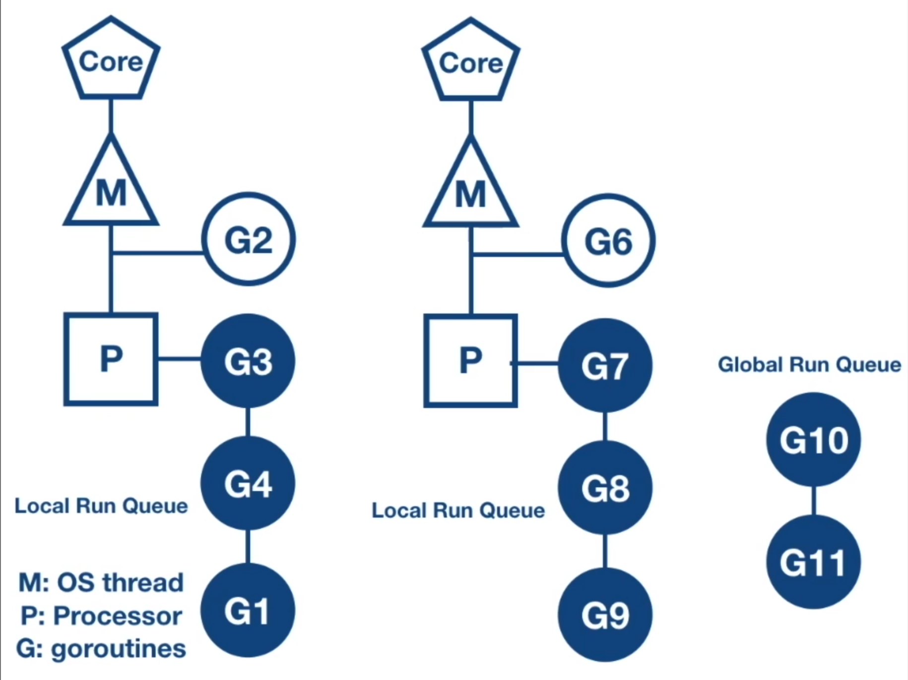

# Concurrency in Go

Table of contents
 - [What is Concurrency?](#what-is-concurrency)
 - [Concurrency in Go](#concurrency-in-go)
 - [Why Concurrency is Hard](#why-concurrency-is-hard)
 - [How Processes Work](#how-processes-work)
 - [How Threads Work](#how-threads-work)
 - [Pros and Cons of Processes and Threads](#pros-and-cons-of-processes-and-threads)
 - [Concurrency is not Parallelism](#concurrency-is-not-parallelism)
 - [Data Races are not Race Conditions](#data-races-are-not-race-conditions)
 - [Challenges](#challenges-in-concurrency)
    - [Race conditions](#race-conditions)
    - [Atomicity](#atomicity)
    - [Synchronization](#synchronization)
    - [Deadlock, Livelocks, and Starvation](#deadlock-livelocks-and-starvation)
    - [Processes, Threads, and the Operating System](#processes-threads-and-the-operating-system)
    - [Thread States](#thread-states)
    - [Thread Limits](#thread-limits)
 - [Concurrency in Go Deep Dive](#concurrency-in-go-deep-dive)
 - [The Go Scheduler](#the-go-scheduler)
 - [Channel Mechanics](#channel-mechanics) 
 - [Goroutine Leaks](/#goroutine-leaks)
 - [Examples](#examples)


## What is Concurrency?

Concurrency is out of order execution. No asumptions can be made about the order of this execution. Concurrent code is designed to run on multicore processors. Concurrent code is nonsequential. A linear sequence of individual steps cannot exist if an algorithm contains parts executed by different processors overlapping in time. 

The out of order nature of concurrent code demands determinacy (exactness). To limit the arbitrariness of out of order exection, we can do two things: 
  1. Analyze all possible effects of the interaction between individual steps.
  2. Control competing access to resources through synchronization tools to restrict the possible execution sequences.

Any effort to verify correctness of a concurrent algorithm by testing, is a questionable malpractice. There's a tremendous amount of variability in concurrent code. Developers run into problems when they think about concurrent problems sequentially. Instead, developers must meticulously iterate through possible scenarios. Even if tests pass many times, you can't conclude that it is error free.

## Concurrency in Go

The `go` keword allows us to run functions concurrently. This keyword creates a lightweight process or thread called a *goroutine*. 

 - [goroutines/example1](goroutines/example1/hello/main.go)


Processes with access to shared resources may run concurrently.

[TODO] Summarize concurrency in Go at a high level


## Why Concurrency is Hard

Threads communicate between each other by sharing memory. Remember that threads share the same address space in a process,
which means they share the heap and the data region (stack and global variables). Sharing memory creates a lot of 
complexity with concurrently executing threads.

If a thread tries to access the same area of memory that another thread is trying to write to, then there will be a data
race and the outcome of the program will be un-deterministic. Concurrent access to memory is not bad by itself, it's only
bad when there's a concurrent read and write to the same space in memory.

One way to guard the access to the shared memory it to use memory access synchronization tools. These tools allow us to
guard the access to the shared memory so that a thread has exclusive access at a time. These tools allow developers to
force concurrent tasks to run sequentially. We can do this by putting a lock around a shared memory resource. Any time
the developer wants to access the shared memory, they need to acquire the lock and when they are done, they need to release
the lock.

If a developer doesn't follow this convention, then we have no guarantee of exclusive access, and there will likely be
a race condition at some time.

Locking has it's disadvantages:
- Locking actually reduces parallelism because locking forces sequential execution.
- Incorrect use of locks can lead to Deadlocks

Here's a circular wait (deadlock) example

```
Thread 1                         Thread 2

 A.Lock(l) // 1st                B.Lock(l) // 2nd
   B.Lock(l) // 3rd (waiting)       A.Lock(l) // 4th (waiting)
   
      Write()                          Write()
   
   B.unlock(l)                      A.Unlock(l)
 A.Unlock(l)                     B.Unlock(l)

```
Thread 1 locks resource A and then Thread 2 locks resource B. When Thread 1 attempts to lock resource B, it can't 
because the resource hasn't been unlocked which places the operation in the waiting queue. Similarly, when Thread 2 
attempts to lock resource B it can't, so the operation is also placed in a waiting state. This creates a circular 
wait scenario or Deadlock. In a deadlock no progress is made, the program will never recover without outside intervention.

## How Processes Work

To understand a process, we have to understand a program. Program code is converted to binary instructions to accommodate the native
language of a computer's central processing unit (CPU). When a program is loaded into computer memory it becomes 
one or more processes. Processes usually run independent of each other and have all the operating system resources
they need. Process can have one or more threads. A thead is a subset of a process. Threads are sometimes called lightweight 
processes because they have access to dedicated and shared memory.

### Multiple Instances of a Program
There can be multiple instances of a single program, and each instance of that running program
is a process. Each process has separate memory address space, which means that a process runs independently and is
isolated from other processes. It cannot directly access shared data in other processes. Switching from one process
to another requires time (relatively) for saving and loading registers, memory maps, and other resources.

This independence of processes is valuable because the operating system tries its best to isolate processes so that a
problem with one process doesn't corrupt or cause havoc with another process.

### Resources a Process Needs

Some essential resources every process needs are registers, a program counter, and a stack. The "registers" are data 
holding places that are part of the CPU. A register may hold an instruction, a storage address, or other kind of data 
needed by the process. The "program counter", also called the "instruction pointer", keep track of where a computer is in
its program sequence. The "stack" is a data structure that stores information about the active subroutines of a computer
program and is used as scratch space for the process. It is distinguished from dynamically allocated memory for the process
that is known as the "heap".


[5]

## How Threads Work

A thread is a unit of execution within a process. A process can have anywhere from just one thread to many threads.

When a process starts, it is assigned memory and resources. Each thread in the process shares that memory and resources.
Threads can communicate with each other more easily than processes can because threads share the same address space as
the process. However, threads are more vulnerable to problems caused by other threads in the same process.

### Single Thread vs. Multi Threaded Processes

In single-threaded processes, the process contains one thread. The process and the thread are one and the same, and 
there is only one thing happening.

In multi-threaded processes, the process contains more than one thread, and the process is accomplishing a number of things
at the nearly same time.

There are two types of memory available to a process, the stack and the heap. Each thread will have its own stack, but
all the threads in a process will share the heap.


One of the operating system's jobs is to select a program from a ready queue from processing. Afterwards, the program starts 
executing and at some later point in time, there might be an interrupt, where the program is interrupted, for example,
a process is waiting for data from a hard drive. When this happens the operating system take over and starts executing,
it swaps out the interrupted job and added a new one from the ready queue. The swapping of jobs is called a context switch.
Context switching is expensive due to the time spent updating variables and memory space. So if you increase the number 
of threads your doing more context switching and spending less time doing useful execution.

## Green Threads

Green threads are user level threads. A normal thread runs at the operating system (kernel) level. A green thread is a
user level thread and it's not the operating system that decides which green thread is to be executed, that's the program's 
responsibility. A green thread would run inside a kernel level thread. Typically you have many green threads running in 
one normal kernel level thread. Green thread are a huge improvement because there kernel does not need to be involved 
system to do context switching, instead its the program that decides what to execute. Green thread don't spend a lot of 
time doing context switching.

The disadvantage with green threads is that the operating system doesn't know anything about them. For example, when 
a green thread needs to read from a drive it needs to wait for data to arrive back. The operating system realizes that a 
thread is waiting for IO and it removes the whole thread from execution even though other green threads might require 
cpu work, however, they're not all waiting for data.  

Go uses a mixture of kernel level threads and green threads. It has a hybrid system. It creates a kernel level thread for
each cpu that you have and each thread contains a number of green threads. So in Go, whenever a green thread tries to do
a synchronous (blocking) operation, the green thread is moved away from the execution and go reshuffles the other green
threads that are not dependent on the IO operation and keeps them running on cpu.

[5]

Threads are sometimes called lightweight processes because they have their own stack but can access shared data. 
Because threads share the same address space as the process and other threads within the process, the operational cost of 
communication between the threads is low, which is and advantage. The disadvantage is that a problem with one thread in 
a process will certainly affect other threads and the viability of the process itself.

### Pros and Cons of Processes and Threads

| Process                                                                           |  Thread  |
|-----------------------------------------------------------------------------------|----------------------------
| Processes are heavyweight operations.                                             | Threads are lighter weight operations.   |
| Each process has its own memory space.                                            | Threads use the memory of the process they belong to.   |
| Inter-process communication is slow as processes have different memory addresses. | Inter-thread communication can be faster than inter-process communication because threads of the same process share memory with the process they belong to.   |
| Context switching between processes is more expensive.                            | Context switching between threads of the same process is less expensive.   |
| Processes don’t share memory with other processes.                                | Threads share memory with other threads of the same process.   |

Go doesn't have strong support for processes like in C but there is some functions to support this.
For example, there is no fork function in Go to spawn a new process programmatically. However, Go does have strong support for threads.


## Concurrency is not Parallelism

Concurrency enables parallelism. However, poorly structured programs can't make efficient use of parallelism to improve performance.
Co-creator of the Go programming language, Rob Pike, believes:
>Concurrency is a way to build things. It's the composition of independently executing things

In other words, concurrency is dealing with lots of things at once; out of order.
Parallelism is about doing a lot of things at once; simultaneously. 

What is good structure? Good structure is composing a program into logical independent or concurrent tasks. Then, to
do a better job we can leverage parallelism or not. Parallelism this way behaves like a free variable we can choose 
to apply later, or not, to improve performance. In terms of program correctness, concurrency is correct even without 
parallelism. You can have concurrency without parallelism and parallelism without concurrency (e.g., in bit-level parallelism). [11]

Often we will use parallelism to build upon concurrency in our programs. To model potential performance gains we can use Amdahl's law.

### Amdahl's Law 

Amdahl's law is a formula to model potential performance gains from implementing a solution to a
problem in a parallel manner. It suggests the speedup you can expect if dependent on the portion of 
parallelism in your program and the number of processors or cores. 


1-P is the sequential piece of the program, where as P is the parallel piece.

Amdahl's law also suggests that adding more cores to your program will at some point create
a diminishing return. In other words, at some point things are not going surpass the speed of the 
sequential portion because as the number of cores gets bigger the parallel portion stays the same. This makes
logical sense, to get more things done at a faster rate you should also increase the parallel portion of the program 
(run more things in parallel).

It allows us figure out when to apply parallelism to address performance issues in our system.
Performance gains are directly dependent on how much a program must be written sequentially (in order).

[Video explanation of Amdahl's Law](https://www.youtube.com/watch?v=WdRiZEwBhsM)

### Gustafson's Law

Gustafson Law supports Amdahl's Law and suggests as long you increase the problem size and the number of processors it 
doesn't really matter how much of your software is linear and how much of it is parallel because the relation is always 
linear. The speed up may be slower if you have a less parallelizable algorithm, however, it is still linear as long as 
you keep increasing you problem size. 

Embarrassingly parallel is a technical term for a problem that can be divided into parallel tasks. 
Embarrassingly parallel programs scale horizontally, which means we can optimize overall performance by adding more CPUs
or machine instances for our program. The execution of parallel tasks runs faster, and what's left is to
then combine and store the results.

Having concurrent tools does not mean you Concurrency is different from parallelism, however the two terms are often used
interchangeably to mean something that runs at the same time as something else.

On a system with multiple processors or CPU cores, multiple processes or threads can be executed in parallel. On a single
processor, it is not possible to have processes or threads truly executing at the same time. In this case, the CPU is
shared among running processes or threads using a process scheduling algorithm that divides the CPU's time and yields
the illusion of parallel execution. The time given to each task is called a "time slice". The switching back and forth
between tasks happens so fast it is usually not perceptible. Parallelism is genuine simultaneous execution and
concurrency is interleaving of processes in time to give the appearance of simultaneous execution.

Concurrency is not just about speeding things up, sometimes its just convenient to program in a multi threaded matter.
Concurrency is a way to structure things to maybe use Parallelism to improve execution. 

Chunks of a program may appear to be running in parallel but really they're executing in a sequential manner.


[5]

Concurrency is about structuring a program into independent tasks but tasks are not guaranteed to run in parallel. 
Adding more concurrent operations alone to an existing design can improve performance. 
Also parallelism can come from a better concurrent expression of the problem. Once you understand the concurrent 
composition of tasks you can parallelize them on different axes to get better throughput or not but at least we
understand the problem in a more fine-grained way. If we don't have parallelism the program can still be correct. 

On a multi-threaded processor, a large input, can be handled concurrently in parallel,
by dividing the input into multiple processes or threads that each have dedicated cpu resources.
A machine with a single-threaded processor, cannot run tasks in parallel because only one thing can be happening at
any given time. Parallelism requires independent concurrent tasks (concurrency) and a multi-threaded processor.

The following table highlights the differences between concurrency and parallelism.

| Concurrency  | Parallelism                                                  |
|---|--------------------------------------------------------------|
| Concurrency is out of order execution | Parallelism is parallel execution                            |
| Concurrency is the composition of independently executing things | Parallelism is the simultaneous execution of multiple things. |
| Concurrency is dealing with lots of things at once.  | Parallelism is about doing a lot of things at once           |
| Concurrency is a property of the code. | Parallelism is a property of running the program.            |
| Concurrency is about structure | Parallelism is about execution                               |
| Concurrency enables Parallelism | Parallelism enhances Concurrency                             |
| Concurrency's goal is good structure | Parallelism is not the goal of Concurrency                   

[Rob Pike talk on "Concurrency is not Parallelism"](https://www.youtube.com/watch?v=oV9rvDllKEg)

## Data races are not Race Conditions

You might be wondering:

> Are data races and race conditions the same thing?

No. Data races and race conditions are not the same thing. Data races and race conditions are independent of one another.
You don't need one to have the other. 

A race condition is a semantic error. It is a flaw that occurs in the timing, or the ordering of events that leads to 
erroneous program behavior. Many race conditions can be caused by data races, but this is not necessary. 

__We can have race conditions without data races and data races without race conditions.__ 

[7]

All these combinations are possible:

|  | data race | no data race |
|---|---|---|
| race condition  | possible  | possible  |
| no race condition  | possible  | possible  |

The definition of a data race is pretty clear, and therefore, its discovery can be automated. A data race occurs when 
2 instructions from different threads access the same memory location, at least one of these memory accesses is a write 
and there is no synchronization (e.g., locking) that is mandating any particular order among these accesses.

Consider the following simple example where x is a shared variable:

```
Thread 1    Thread 2

 lock(l)     lock(l)
 x=1         x=2
 unlock(l)   unlock(l)
```
In this example, the writes to x from thread 1 and 2 are protected by locks, therefore they are always happening in some order enforced by the order with which the locks are acquired at runtime. That is, the writes' atomicity cannot be broken; there is always a happens before relationship between the two writes in any execution. We just cannot know which write happens before the other a priori.

There is no fixed ordering between the writes, because locks cannot provide this. If the programs' correctness is compromised, say when the write to x by thread 2 is followed by the write to x in thread 1, we say there is a race condition, although technically there is no data race.

It is far more useful to detect race conditions than data races; however this is also very difficult to achieve. [6]

## Challenges in Concurrency

All threads share the same physical address space.

There are 4 main challenges for concurrent programs:

1) race conditions
2) atomicity
3) synchronization
4) deadlocks, livelocks, and starvation

## Race conditions

Race condition is a flaw that occurs when the timing or ordering of events affects a program's correctness.
For example, when two or more operations must execute in the correct order, but the program has
not been written so that this order is guaranteed to be maintained. 

Generally speaking, some kind of external timing or ordering non-determinism is needed to produce a race condition; typical
examples are context switches, OS signals, memory operations on a multiprocessor, and hardware interrupts.

Race conditions may not show up immediately, they could be lurking in production for years until the show up.

Data race happens when there are two memory accesses in a program where both:
- target the same location
- are performed at the same time by two threads
- are not reads
- are not synchronized

In other words, a data race is a scenario when one concurrent operation attempts to read a variable while at some
determined time another concurrent operation is attempting to write to the same variable.

Most of the time, data races are introduced because the developers are thinking about the problem sequentially. 
They assume that because a line of code falls before another that it will run first.

When writing concurrent code, you have to meticulously iterate through the possible scenarios. It may help to imagine
large periods of time passing between operations. How would the rest of the program behave?

## Atomicity

Atomicity means that within the context that something is operating in, it is indivisible, or 
uninterruptible. Atomicity is important because when something is considered atomic, or to have the property of 
atomicity, it is safe within concurrent contexts (free from data races). 


Context is important. Something may be atomic in one context, but not another. The atomicity of an operation can change 
depending on the currently defined scope.

When thinking about atomicity, very often the first thing you need to do is to define the context, or scope, the 
operation will be considered to be atomic in. 

So when something is indivisible or uninterruptible, that means that 
within the context you've defined, something that is atomic will happen in its entirety without anything happening in 
that context simultaneously. We developers must determine which areas of our code need to be atomic and at what level of
granularity. 

## Synchronization

Critical section is a section of your program that needs exclusive access to a shared resource.
There are various ways to guard your program's critical sections. One way is to synchronize access to the memory between
your critical sections. Anytime developers want to access a variable's memory, they must first call `Lock()` (from [sync](https://tour.golang.org/concurrency/9)),
and when they're finished they must call `Unlock()`. Code between those two statements can then assume it has exclusive access
to the data; in other words, synchronized access to the memory. If developers don't follow this rule then there is no 
guarantee of exclusive access.

Eliminating data races doesn't automatically remove race conditions. The order of operations may still be 
unpredictable or nondeterministic, but you have narrowed the scope on the nondeterminism.

## Deadlock, Livelocks, and Starvation

### Deadlock

Deadlock program is one in which all concurrent processes are waiting on one another. 

In a deadlock, the program will never recover without outside intervention. The Go runtime will detect some deadlocks
but it won't help you prevent them. In a deadlock, both goroutines wait indefinitely on each other.


### The Coffman Conditions

Coffman conditions are 4 conditions that must be present for deadlocks to arise. Consequently,
these conditions form the basis for techniques that help detect, prevent, and correct deadlocks. The conditions are:

1) mutual exclusion
2) wait for condition 
3) no preemption 
4) circular wait

Mutual exclusion means a concurrent process holds exclusive rights to a resource at any one time.

Wait for condition means a concurrent process must simultaneously hold a resource and be waiting for an
   additional resource.
   
No preemption means a resource held by a concurrent process can only be released by that process, so it
fulfills this condition.
   
Circular wait means a concurrent process (P1) must be waiting on a chain of other concurrent processes 
   (P2), which are in turn waiting on it (P1), so it fulfills this final condition too.

 > __If we ensure at least one of these conditions is not true, we can prevent deadlocks from occurring.__
 
### Livelock 

Livelocks are programs that are actively performing concurrent operations, but these operations
do nothing to move the state of the program forward (no progress).

A very common reason livelocks are written: two or more concurrent processes attempting to prevent a deadlock without 
coordination.

> __Livelocks can be more difficult to detect than deadlocks because it can appear as if the program is doing work. Livelocks
are a subset of a larger set of problems called starvation.__

### Starvation

Starvation is any situation where a concurrent process cannot get all the resources it needs to perform work.
In a livelock, all the concurrent processes are starved equally, and no work is accomplished. Generally, starvation
implies that there are one or more greedy concurrent process  that are unfairly preventing one or more concurrent 
processes from accomplishing work as efficiently as possible, or maybe at all.

One of the ways you can detect and solve starvation is by logging when work is accomplished, and then determining if your 
rate of work is as high as you expect it.

If you utilize memory access synchronization, you'll have to find a balance between preferring coarse-grained 
synchronization for performance, and fine-grained synchronization for fairness. You should constrain memory access 
synchronization only to critical sections at first; if the synchronization becomes a performance problem, you can always 
broaden the scope. It's much harder to go the other way.

> __Starvation can come from outside the Go process, like from CPU, memory, file handlers, database connections:
any resource that must be shared is a candidate for starvation.__

## Processes, Threads and the Operating System

To understand concurrency, we need to understand processes, threads and the role of the operating system. 
Operating systems try to give every process attempting to run on the machine equal access to CPU, memory and other 
resources. Sometimes higher priority tasks take precedence.

process is an instance of a running program. Processes provide an environment for a program to 
execute.   

When a program is executed the operating system creates a process and allocates memory in the virtual address space. 

A virtual address space is the set of ranges of virtual addresses that an operating system makes 
available to a process.

The virtual address space contains various segments. 

A segment is just a contiguous portion of the address space of a particular length. Usually, there's
three logically-different segments:

|  Segment | Purpose  |
|---|---|
| Code  | contains compiled machine code instructions.  | 
| Heap  |  contains dynamic memory allocation. | 
| Stack  |  containing local variables of a function | 

> "Segmentation solves a number of problems and helps us build a more effective virtualization of memory. Beyond just
dynamic relocation, segmentation can better support sparse address spaces, by avoiding the huge potential waste of 
memory between logical segments of the address space. It is fast, as doing the arithmetic segmentation requires is easy and 
well-suited to hardware; the overheads of translation are minimal. If code is placed within a separate segment, such a 
segment could potentially be shared across multiple running programs." 

[1]

A thread is the smallest unit of execution that CPUs accept. A process has at least one thread - the
main thread, but it can have multiple. Threads share the same address space. Each thread has its own stack and threads 
run independently of each other.

The operating system scheduler, makes scheduling decisions at the thread level, not at the process level. Threads can
run concurrently, with each thread taking turns on the individual core or the can run in parallel with each thread 
running at the same time on different cores.

### Thread States

When a process is created, the main thread is put into the ready queue. It is in the runnable state.
Once the CPU is available, the thread starts to execute and each thread is given a time slice.
if that time slice expires, then the thread gets preempted (paused) and placed back on to the ready queue. 

If the thread gets blocked due to an I/O operation like read/write on disc or network operation or waiting for the event
from other processes, then it is placed in the waiting queue until the I/O operation is complete. Once complete,
it is placed back onto the ready queue.


[2]

A time slice is a short interval of time allotted to each user or program in a preemptive multitasking
or timesharing system. 

### Thread limits

Two well known limitations with threads:

1. Fixed stack size - caps the number of threads that we can create to the amount of memory we have.
2. C10k problem - as we scale up the number of threads, the scheduler cycle increases and the application can
   become less responsive.
   
### C10k problem

Complications arise when trying to scale the number of threads in a process. The scheduler allocates a time slice for
each process to execute on a CPU core. This time slice is equally divided among the threads. 

If the scheduler period as 10 milliseconds, given two threads, each thread is going to get 5 milliseconds for execution.

If we have 5 threads, each thread is going share the 10 milliseconds scheduler period and get two milliseconds to execute and so on.

As we increase the number of threads, CPU will be spending more time in context switching than running the application.

There's no guaranteed minimum time for a thread, but a thread needs enough time to do meaningful work. In contrast, if 
you gave give thousands of threads a minimum time of 2 milliseconds than the schedule periods can easily take up
seconds of time making an application less responsive.

### Fixed Stack Size

The operating system uses a fixed stack memory size for each thread. 

Stack memory is a memory mechanism that allows the system 
memory to be used as temporary data storage that behaves as a first-in-last-out (FILO) _buffer_. In other words, when 
popping items off the stack, the first item in the stack is the last the leave the stack buffer.

A buffer is a reserved segment of memory within a program that is used to hold the data being processed.
Buffers are set up in every program to hold data coming in and going out. 

The fixed stack size limits the number of threads we can create. The stack size depends on the hardware. Given a max 
stack size of 8192 kilobytes, and 16 GB Random Access Memory (RAM), a machine can run a maximum of 2000 threads.


Calculating max threads:
> T = maximum threads
>
> 8192kb ⇒ .008gb ⇒ 16gb = 0.008gb x T ⇒ T = 2000

### Context Switching

Contexting switching is expensive. The process of context switching can have a negative impact on system performance. 
Much of the design of operating systems goes towards optimizing the use of context switches.

A context switch is the process of storing the state of a process or thread, so that it can be restored
and resume execution at a later point. This allows multiple processes to share a single CPU and is an essential feature
of a multitasking operating system.

In other words, CPU has to spend time copying the context of the current executing thread into memory and restoring the 
context of the next chosen thread. It takes thousands of CPU instructions to do context switching, and it is a wasted time
as CPU is not running your application, but doing context switching.

Context switching between threads are relatively cheap relative to context switching between different processes.


[4]

A context switch can occur as the result of an interrupt, such as when a task needs to access disk storage, freeing up
CPU time for other tasks. Some operating systems require a context switch to move between user mode and kernel mode tasks.

> "Switching from one process to another requires a certain amount of time for doing the administration – saving and 
> loading registers and memory maps, updating various tables and lists, etc. What is actually involved in a 
> context switch depends on the architectures, operating systems, and the number of resources shared (threads that
> belong to the same process share many resources whether compared to unrelated non-cooperating processes. [3]

## Concurrency in Go Deep Dive

Go overcomes some limitations with threads. Concurrency in Go is based on the paper written by Tony Hoare,
"Communicating Sequential Processes" or CSP. CSP inspired the use of channels.

#### 3 Core Principles

1. Each process is built for sequential execution.
2. Data is communicated between processes (using channels)
3. Scale by adding more instances of the process.

#### Go's Concurrency Tools

|  Tool  | Purpose     |
|---| ---|
|goroutines| allows us to run function concurrently |
|channels | allows us to communicate between concurrently executed functions|
|select|used to multiplex the channels |
|sync package| provides classical synchronization tools like the mutex, conditional variables and others|

Goroutines are like threads but they're much cheaper. They are user space threads, managed by the Go runtime. The Go runtime is part of the executable,
it is built into the executable of the application. Goroutines are extremely lightweight, goroutines start with 2KB of stack,
which can grow and shrink as required. Goroutines are multiplexed onto OS threads as required. So you don't have to worry
about scheduling and blocking, the system takes care of that for you. When a goroutine does need to blocks (like 
doing a read system call), that thread blocks but no other goroutine blocks and needs to wait for it (they are all scheduled
dynamically). So they feel like threads but they are lighter.

Goroutines have a very low CPU overhead, the amount of CPU instructions required to create a goroutine is small. This 
enables us to create hundreds of thousands of goroutines in the same address space as the program.

Data is communicated between the goroutines using channels, which allows them to avoid sharing memory.

The cost of context switching in goroutines is much cheaper that context switching in threads because goroutines have much less
state to store. The Go runtime can be more selective in what data is persisted, how it is persisted and when persisting
needs to occur.

__The Go runtime creates operating system threads, goroutines run in the context of the operating system thread.__

Many goroutines can run in the context of a single operating system thread. The operating system schedules the OS thread
 and the Go runtime schedules multiple goroutines on the OS thread. For the operating system nothing has changed, it is 
still scheduling the threads like before. The Go runtime simply manages the scheduling of the goroutines on the OS threads.

## The Go Scheduler

The Go scheduler is part of the Go runtime, the Go runtime is part of the executable, it is built into the executable
of the application. The Go scheduler is also known as an M:N scheduler (hybrid threading).

> "__M:N maps some M number of application threads onto some N number of kernel entities, or virtual processors.__ In general, M:N threading systems are 
more complex to implement than either kernel or user threads, because changes to both kernel and user space code are 
required. __In M:N implementation, the threading library is responsible for scheduling user threads on the available schedulable
entities; this makes context switching of threads very fast, as it avoids system calls.__ However, the increases complexity
and the likelihood of priority inversion, as well as suboptimal scheduling without extensive (and expensive) coordination
between the userland scheduler and the kernel scheduler." [9]

The Go scheduler run in the user space. Goroutines are scheduled on OS threads by the Go scheduler. So a goroutine runs 
in the context of the OS thread. The Go runtime creates a number of worker OS threads, equal to GOMAXPROCS environment
variable value. The GOMAXPROCS variable limits the number of operating system threads that can execute user-level Go code
simultaneously. There is no limit to the number of threads that can be blocked in system calls on behalf of Go code; 
those do not count against the GOMAXPROCS limit. GO's `runtime` package provides `func GOMAXPROCS(n int)` to query and change
the maximum number of CPUs that can be executing simultaneously and returns the previous setting. It defaults to 
`runtime.NumCPU`, the default value is the number of processors on the machine.

So if we have 4 cores, then 4 OS threads will be created. It is the responsibility of the Go scheduler to distribute 
runnable goroutines over multiple threads that are created.   

As of Go 1.14, the Go scheduler implements asynchronous preemption. It used to be a co-operative scheduler, but then the 
question came, what happens when a long running routine just hogs the CPU? Before Go 1.14 Goroutines were just blocked 
and the bug was hard to diagnose and fix.

The problems with function call preemption were caused by tight loops:

- Loops cause scheduling latency
- Latency reduces message delivery (application throughput)
- Loops can cause scheduler deadlocks

Go needed a way to preempt tight loops. This is why asynchronous preemption was implemented. In asynchronous 
preemption, what happens is, a goroutine is given a time slice of 10 miliseconds for execution. When that time slice is
over, the Go scheduler will try to preempt it. This provides other goroutines the opportunity to run even when
there are long running CPU bound goroutines scheduled. 

Similar the threads, goroutines also have thread states. When it is created, goroutines will be in a
runnable state, waiting in the run queue. It moves to the executing state once the goroutine is scheduled on
the os thread. If the goroutine run through its time slice then it is preempted and placed back into the run queue.
If the goroutine get block on any condition, like blocked on a channel, or blocked on a syscall, or
waiting for a mutex lock, then they are moved to a waiting state. Once the I/O operation is complete, they are moved back
to the runnable state.


For a CPU core, the Go runtime creates an OS thread which is represented by the letter M. An OS thread works very much 
like a POSIX thread. The Go runtime also creates a logical processor P and associates that with th OS thread M.
The logical processor holds the context for scheduling, which can be seen as a local scheduler running on a thread.

G represents a goroutine running on the OS thread. Each logical processor P has a local run queue where runnable goroutines
are queued. There is a global run queue, once the local queue is exhausted, the logical processor will pull goroutines from
the global run queue. When new goroutines are created, they're added to the end of the global run queue. 


 
When a goroutine has reached a scheduling point, then the logical processor will pop a goroutine off the local run queue
and sets the stack and the instruction pointer for the new goroutine and begins running that goroutine. The previous 
running goroutine is placed back into the local run queue. There is no change as far as the OS is concerned. The OS is 
still scheduling the same OS thread. The context switching between the goroutines is managed by the logical processor.

There is a one to one mapping between OS thread and the logical processor, if there are two cores and we have set 
GOMAXPROCS to 2 then the go runtime, creates another OS thread and logical processor and associates the OS thread with
the logical processor and goroutines can be scheduled on the second OS thread. 



#### Context Switching due to Synchronous System Call
What happens in general when synchronous system calls are made, like reading or writing to a file with sync flag set?

There will be a disc I/O operation performed, so a synchronous system call will block for the I/O operation to complete.
Due to this, the OS thread can be moved out of the CPU and placed in the waiting queue for the disc I/O to complete. 
So we will not be able to schedule any other goroutine on that thread. This implies that a synchronous system call can 
reduce parallelism. 


G1 is going to make a synchronous system call, like reading on a file, that will make the OS thread M1 to block. The Go scheduler
identifies that G1 has caused the OS thread M1 to block, so it brings in a new OS thread, either from the thread pool
cache or it creates a new OS thread if a thread is not available in the thread pool cache. Then the Go scheduler will detach
the logical processor P from the OS thread M1 and move it to the new OS thread M2.


 

Once the synchronous system call that was made by G1 is complete, then it is moved back to the end of the local
run queue on the logical processor P and the M1 is put to sleep and placed in the thread pool cache. This 
is good because it can be utilized in the future when the same scenario happens again. 

#### Context Switching due to Asynchronous System Call

What happens when an asynchronized system call is made?

An asynchronized system call happens when the file descriptor that is used for doing network I/O operation is 
set to non-blocking mode. If the file descriptor is not ready, for example, if the socket buffer is empty and we are 
trying to read from it, or if the socket buffer is full and we are trying to write to it, then the read or the write 
operation does not block, but returns an error and the application will have to retry the operation again at 
a later point in time. This increases the application complexity.

In a Unix-like operating system, a file descriptor is a unique identifier for a file or other input/output resource, such
as a pipe, or network socket.[12]

The application will have to create an event loop and set up callbacks, or it has to maintain a table mapping the
file descriptor and the function pointer, and it has to maintain a state to keep track of how much data was read or
written the last time. 

Go uses the net poller to handle asynchronous system calls. There is an abstraction built-in syscall package. Syscall package uses netpoller to convert 
asynchronous system call to a blocking system call. When a goroutine makes an asynchronized system call, and the file descriptor
is not ready, then the go scheduler use netpoller OS Thread to park the Goroutine. The netpoller uses an interface 
provided by operating system, like epoll on Linux, kqueue on MacOs, and iocp on Windows, to do the polling on the file descriptor.

Once the netpoller gets a notification from the operating system, it in-turn notifies the goroutine to retry th I/O 
operation. In this way, the complexity of managing asynchronous system call is moved from the application to go runtime.

So the application does not need to make a call to select or poll and wait for the final descriptor to be ready, but instead,
it will be done by the netpoller in an efficient manner.

The application complexity of managing asynchronous system calls is moved to the Go runtime, which manages it efficiently.

#### Work Stealing

Work stealing helps to balance the goroutines across the logical processors. This way work gets better distributed and 
gets done more efficiently. 

The work stealing rule says that, if there are no goroutines in the local run queue, then try to steal from other logical 
processors randomly. If not found, check the global run queue for the goroutines. If not found, check the netpoller. 

#### Garbage Collection

Garbage collectors can be characterized as precise or conservative. Go's garbage collector is precise, which means it 
has lots of metadata that tells it what is and isn't a pointer. A conservative collector just looks at bytes in memory 
and if something could be a pointer, it assumes it is a pointer (There are no stack maps. This was the problem).

Conservative GC only works if the GC is also a non-moving GC. Most GCs are moving, meaning that they can move objects
so they have to be able to update pointers to those objects when they move them, which means they really need to know 
what is and isn't a pointer, otherwise they make corrupt memory by updating something that looked like a pointer but 
really wasn't. 

Go has a non-moving garbage collector, so it is compatible with conservative GC. 


One of the biggest disadvantages of non-moving collectors compared to moving
collectors has been their limited ability to deal with memory fragmentation. 

Moving garbage collectors (i.e, copying and compacting garbage collectors) eliminate
fragmentation by moving live data and leaving all free space in consecutive locations. Non-moving collectors are unable to
move live data, and therefore free memory is interleaved with holes of live memory. This causes that some requests for free
memory will not be satisfied with the available free memory because it is not in consecutive locations, even though the
total free memory could be greater than the amount requested.

Moving-collectors can solve the fragmentation problem. Unfortunately, moving collectors can not be used in environments
where no accurate pointer information is available, since pointers in live objects have to be updated when the objects they
point to, are moved. For example, off-the-shelf C and C++ compilers do not give accurate pointer information. 

[Loop Preemption in Go 1.14](https://www.youtube.com/watch?v=1I1WmeSjRSw)

## How Channels Work

- hchan struct represents a channel
- It contains circular ring buffer and mutex lock
- Goroutines that get blocked on send or recv are parked in sendq or recvq
- Go scheduler moves the blocked goroutines, out of OS thread
- Once channel operation is complete, goroutine is moved back to local run queue

### Basics

Channels help facilitate communication between goroutines. Goroutines can be synchronized via channels. Channels are 
typed and thread safe.  

Let `T` stand for a given type we want associated with a channel. To delcare a channel we do:

```go
var ch chan T
ch = make(chan T)

// or 

ch := make(chan T)
```

The pointer operator `<-` is used to send and receive the value from the channel. The arrow indicates the direction
of the data flow. 

#### SYNTAX
| SEND                                 | RECEIVE                           |
|--------------------------------------|-----------------------------------|
| `ch <-v`                             | `v := <-ch`                       |
| value is sent to channel | value is received from channel |

Go recommends to use channels primarily when sharing memory access between goroutines, over traditional synchonization tools
like _mutex locks_. 

### Rule of thumb
> "Do not communicate by sharing memory; instead, share memory by communicating"

### Channels Block

1. The _sending goroutine_ is going to block until there is a coresponding receiver goroutine ready to receive the value.
    ```go
   go func() {
     ch <- v // wait until a receiver is ready to receive a value.
     fmt.Println("Println won't execute until there is a receiving goroutine.")
   }()
   ```
2. The _receiving goroutine_ is going to block until there is a corresponding sender goroutine sending a value.
   ```go
   func() main {
     ch := make(chan int)
     // ...
     <- ch // wait until a sender is sending a value. 
     fmt.Println("Println won't execute until there is a sender goroutine.")
   }
   ```
It is the responsibility of the channel to make the goroutine runnable again once the channel has data.

### Issues with Channels

The channels default value is `nil`. It is important to use `make()` to allocate memory for the channel. Various 
errors can occur when improperly using channels. 
1. Deadlocks occur when writing to a `nil` channel.
2. Panics occur when:
   - closing a nil channel
   - writing to a closed channel
   - closing a channel more than once.

To avoid these issues it is recommended to designate channel owners. 

The  goroutine that instantiates writes and closes  a channel is the owner of the channel. Furthermore, channel utilizers
should have read-only access to the channel. With these practices you can help avoid panics and deadlocks.

### Two Types of Channels

There are two types of channels: 

1. Buffered Channels
2. Unbuffered Channels 

Buffered channels are channels with a buffer between the sender and the receiver goroutine. Channels are given a capacity
 or buffer size that represents the amount of the elements that can be sent without the receiver being ready to receive 
the values. Basically, the sender can keep sending values without blocking until the buffer gets filled. When the buffer 
get filled the sender will block. The receiver can keep receiving values without blocking until the buffer gets empty. 

Unbuffered channels don't have a buffer between sender and receiver goroutines. This makes the relationship between goroutines
synchronous. Because there is no buffer, the sender goroutine will block until there is a receiver to receive a value. 
The receiving goroutine will block until there is a sender sending a value.

### Receiving Values From Channels

The receive channel returns two values. 
1. The received value from the channel.
2. A second boolean value which indicates whether the value that is being read from the channel is a value that is generated
by a _write_ or a default value being generated by a _close_ of the channel.

```go
value, ok := <-ch
// ok = true (write)
// ok = false (close)
```

You can also range over channels. This allows you to iterate over values received from a  channel. The loop automatically
breaks when a channel is closed. 


> ```go
> for value := range ch {
>   //.. 
> }
>``` 
> __Note!__ Ranging over values does gnot return a second value.


### Structure 

We use the built-in function make to create channels. 

```go
ch := make chan int, 3
```
Internally, the channels are represented by the hchan struct (head chan).
[src/runtime/chan.go#L33](https://github.com/golang/go/blob/20a71c9a1d7e0d246dfad2c2a2057c954324217d/src/runtime/chan.go#L33)

The struct has a mutex `lock` field. Any goroutine doing any channel operation must first acquire the lock on the 
channel. `buf` id a circular ring buffer when the actual data is stored and this is used only for the buffered channels,
`dataqsiz`, is the size of the buffer. `qcount` indicates the total data elements in the queue. `sendx` and `recvx` 
indicates the current index of the buffer from where it can send, or receive data. `recvq` and `sendq` are the waiting
queues which are used to store blocked goroutines, the goroutines that were blocked while they were tying to send data or
while they were trying to receive data from the channel. `waitq` is the linked list of goroutines, the elements in the 
linked list is represented by the `sudog` struct.

In the `sudog` struct, we have the field `g`, which is a reference to the goroutine, and `elem` field is a pointer
to memory, which contains the value to be sent, or to which the received value will be written to. When we create a 
channel with built-in function make, hchan struct is allocated in the heap, and make returns a reference to the allocated
memory. Since ch is a pointer, it can be sent between the functions which can perform, send or receive operation on the 
channel. 


### Send and Receive

In a send and receive scenario between 2 goroutines:

- There is no memory sharing between goroutines
- Goroutines copy elements into and from hchah
- hchan is protected by mutex lock

### Buffer is Full
- When channel buffer is full and a goroutine tries to send a value
- Sender goroutine gets blocked, it is parked on sendq
- Data will be saved in the elem field of the sudog structure 
- When receiver comes along, it dequeues the value from buffer
- Enqueues the data from elem field to the buffer.
- Pops the goroutine in sendq and puts it into runnable state

### Buffer is Empty

- When a goroutine calls receive on empty buffer
- Goroutine is blocked, it is parked into recvq
- elm field of the sudog structure holds the reference to the stack variable of the receiver goroutine
- When sender comes along, Sender finds the goroutine in recvq
- Sender copies the data into the stack variable on the receiver goroutine directly
- Pops the goroutine in recvq and puts it into runnable state

### Unbuffered Channel

#### Send on an unbuffered channel

- When sender goroutine wants to send values
- If there is corresponding receiver waiting in recvq
- Sender will write the value directly into receiver goroutine stack variable
- Sender goroutine puts the receiver goroutine back to runnable state
- If there is no receiver goroutine in recvq
- Sender gets parked into sendq
- Data is saved in elem field in sudog struct
- Receiver comes and copies the data 
- Puts the sender to runnable state again

#### Receive on an unbuffered channel

- Receiver goroutine want to receive a value
- If it finds a goroutine in waiting in sendq
- Receiver copies the value in elem field to it variable
- Put the sender goroutine to runnable state
- If there was no sender goroutine in sendq
- Receiver gets parked into recvq
- Reference to variable is saved in elem field in sudog struct
- Sender comes and copies the data directly to receiver stack variable
- Puts the receiver to runnable state

## How Do Selects Work

`select` allow you to have out out order execution of concurrent goroutines. select is like a switch statement, each
case statement specifies a send or receive on some channel and it has an associated block of statements.

Each case statement is not evaluated sequentially, but all channel operations are considered simultaneously to see if 
any of them is ready. Each case has an equal chance of being selected. select waits until some case is ready to proceed, 
if none of the channels are ready, the entire select statement is going to block, until some case is ready for the
communication. When one channel is ready, then it performs the channel operation and executes the associated block of
statements.

If multiple channels are ready, then it's going to pick one of them at random. So it is very helpful in implementing 
timeouts and not blocking communication.

You can specify time out on the channel operation by using select and `time.After()` function,
select will wait until there is a event on the channel or util the timeout is reached. The time.After() function
will take a time duration as input, and it returns a channel. It  will start a goroutine in the background and sends the value
on the channel after the specified time duration. 

If there was no goroutine, which has sent a value then it just executes the default case.

The empty select statement will block forever and select on the nil channel will also block forever.

## How Sync Package Works

### Mutex

When should you use channels over a mutex?

|Channels|Mutex |
|---|---|
| Passing copy of data| Protect Caches |
| Distributing units of work| Protect State |
| Communicating asynchronous results| |

A mutex is used to protect shared resources. It is a developers convention to call Lock() to access
shared memory and call Unlock() when done. The critical section represents the bottleneck between the
goroutines.

### Atomic

Atomic us used to perform low level atomic operation on the memory. It is used by other synchronization
utilities. It is a lockless operation. Used for atomic operations on counters.


### Condition Variable

Condition variable is one of the synchronization mechanisms. A condition variable is basically a 
container of goroutines that are waiting for a certain condition. The question, is how can we make a goroutine wait
until some event or condition occurs, one way could be to wait in a loop for the condition to become true. But this is inefficient. 
What we need is some way to make the goroutine suspend while waiting, and some way to signal the suspended goroutine that,
that particular event has occurred.

We can use channels to block the goroutine on receive and sender goroutine to indicate the occurrence of the event, but
what if there are multiple goroutines waiting on multiple conditions? 

Condition variables are of type sync.Cond, we use the constructor method, NewCond() to create a conditional variable, 
and it takes a sync locker interface as input, which is usually a sync mutex. Theis allows the conditional variable to 
facilitate the coordination between goroutines in a concurrent safe way.

The sync/cond package contains three methods: `wait`, `signal` and `broadcast`. wait suspends the execution of the calling
thread and it automatically releases the lock before suspending the goroutine. Wait does not return unless it is woken up
by a broadcast or a signal. Once woken up, it acquires the lock again. On resume, the caller should check for the condition
again because it is possible another goroutine could get scheduled between the signal and the continuation of the wait and
change the state of the condition. 

Signal wakes up one goroutine that was waiting on a condition. The signal finds a goroutine that was waiting the longest
and notifies that goroutine. It is allowed but not required for the caller to hold the lock during this call. 

Broadcast wakes up all the goroutines that were waiting on the condition and is allowed but it is not required for the caller
to hold the lock during this call.

## Goroutine Leaks

A common type of memory leak in go is a goroutine leak. If  you start a goroutine that you expect to eventually terminate,
but it never does, it has leaked. This means it lives for the life time of the application and any memory allocated for the goroutine can't be released.

### Rule of thumb
> Never stop a goroutine without knowing when it will end.

In other words, everytime you write the `go` statement in a program you should consider how and under what conditions, 
the goroutine will end.

Sometimes goroutines may run until the program exits but they are not an exception to this rule. Goroutines, while efficient,
have a finite cost in terms of memory footprint. So you can't create an infinite number of them.

## Examples

### Goroutines
 - [goroutines/example1/hello](goroutines/example1/hello/main.go)
 - [goroutines/example2/server](goroutines/example2/server/main.go)

### Channel Examples

- [channels/example1/channel](channels/example1/channel/main.go)
- [channels/example2/channelrange](channels/example2/channelrange/main.go)
- [channels/example3/bufferedchannel](channels/example3/bufferedchannel/main.go)
- [channels/example4/channeldirection](channels/example4/channeldirection/main.go)
- [channels/example5/channelownership](channels/example5/channelownership/main.go)

### Select Examples
- [select/example1](select/example1/main.go)
- [select/example2](select/example2/main.go)
- [select/example3](select/example2/main.go)


### Special Example
- [boids simulation](boids/main.go)

### More Examples

[https://github.com/andcloudio/go-concurrency-exercises](https://github.com/andcloudio/go-concurrency-exercises)

<hr/>

Resources

[1] [https://pages.cs.wisc.edu/~remzi/OSTEP/vm-segmentation.pdf](https://pages.cs.wisc.edu/~remzi/OSTEP/vm-segmentation.pdf)

[2] [https://www.geeksforgeeks.org/thread-states-in-operating-systems/](https://www.geeksforgeeks.org/thread-states-in-operating-systems/)

[3] [https://en.wikipedia.org/wiki/Context_switch](https://en.wikipedia.org/wiki/Context_switch)

[4] [https://www.udemy.com/course/concurrency-in-go-golang](https://www.udemy.com/course/concurrency-in-go-golang)

[5] [https://www.backblaze.com/blog/whats-the-diff-programs-processes-and-threads/](https://www.backblaze.com/blog/whats-the-diff-programs-processes-and-threads/)

[6] [https://stackoverflow.com/questions/11276259/are-data-races-and-race-condition-actually-the-same-thing-in-context-of-conc](https://stackoverflow.com/questions/11276259/are-data-races-and-race-condition-actually-the-same-thing-in-context-of-conc)

[7] [https://blog.regehr.org/archives/490](https://blog.regehr.org/archives/490)

[8] The Linux Programming Interface, Michael Kerrisk, No Strach Press, pg.21-23

[9] [https://en.wikipedia.org/wiki/Thread_(computing)#Threading_models](https://en.wikipedia.org/wiki/Thread_(computing)#Threading_models)

[10] [https://www.cs.purdue.edu/homes/grr/ISMM98-grr-mps-cef.pdf](https://www.cs.purdue.edu/homes/grr/ISMM98-grr-mps-cef.pdf)

[11] [https://en.wikipedia.org/wiki/Parallel_computing](https://en.wikipedia.org/wiki/Parallel_computing)

[12] [https://en.wikipedia.org/wiki/File_descriptor](https://en.wikipedia.org/wiki/File_descriptor)

[13] Nonsequential and Distributed Programming with Go, Christian Mauer, Springer